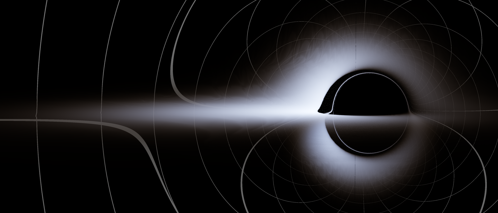

# KerrTrace - GPU 广义相对论光线追踪器



KerrTrace 是一个基于物理的高性能光线追踪器，旨在利用 CUDA 加速模拟克尔（Kerr）黑洞周围的弯曲时空。本项目采用 Rust 作为宿主语言进行逻辑控制，利用 CUDA C++ 进行核心的数值积分与渲染计算，能够生成精确的黑洞吸积盘影像、引力透镜效应以及红移/蓝移现象。

## 1. 物理模型与数学基础

本项目并非基于近似的图像空间扭曲，而是通过求解广义相对论中的测地线方程来模拟每一个光子的运动轨迹。

### 1.1 时空度规 (Spacetime Metric)

为了避免博耶-林德奎斯特（Boyer-Lindquist）坐标系在事件视界处可能出现的坐标奇异性，并便于光线追踪的数值计算，本项目采用了 **笛卡尔克尔-希尔德（Cartesian Kerr-Schild）坐标系**。

在该坐标系下，光子的运动方程通过哈密顿力学体系（Hamiltonian Formalism）描述。对于零质量粒子（光子），其哈密顿量 $\mathcal{H}$ 为：
$$ \mathcal{H}(x^\mu, p*\mu) = \frac{1}{2} g^{\mu\nu} p*\mu p*\nu = 0 $$
其中 $g^{\mu\nu}$ 是克尔度规的逆张量，$p*\mu$ 是光子的四动量。

### 1.2 运动方程

系统通过求解哈密顿方程组来推进光线：
$$ \frac{dx^\mu}{d\lambda} = \frac{\partial \mathcal{H}}{\partial p*\mu}, \quad \frac{dp*\mu}{d\lambda} = -\frac{\partial \mathcal{H}}{\partial x^\mu} $$
代码中（`cuda/kerr_math.cuh`）显式实现了这些导数的解析解，避免了使用克里斯托费尔符号（Christoffel symbols）带来的巨大计算开销。这使得追踪过程在 GPU 上极其高效。

### 1.3 吸积盘模型 (Novikov-Thorne)

吸积盘采用 **Novikov-Thorne 模型**，描述了一个几何厚度为零、光学厚度无限大的相对论性薄盘。

- **温度分布**：吸积盘的径向温度分布由黑洞的质量 $M$、自旋 $a$ 以及吸积率决定。项目通过预计算 Novikov-Thorne 通量因子 $f(r)$ 来确定温度 $T(r)$。
- **最内稳定圆轨道 (ISCO)**：吸积盘的内边缘被截断在 ISCO 半径处，该半径取决于黑洞的自旋参数 $a$（顺行与逆行轨道不同）。
- **相对论性致光 (Relativistic Beaming)**：考虑了多普勒效应和引力红移。光子到达观测者的能量变化由红移因子 $g$ 决定：
  $$ g = \frac{E*{obs}}{E*{emit}} = \frac{k*\mu u^\mu*{obs}}{k*\nu u^\nu*{disk}} $$
  这导致了吸积盘一侧显著亮于另一侧的特征（Beaming effect）。

## 2. 数值积分算法

为了保证光线追踪的精度和效率，核心积分器并未采用定步长的欧拉法或 RK4，而是实现了高阶自适应步长算法。

### 2.1 Dormand-Prince 5(4) 积分器

项目使用了 **Dormand-Prince (RK5(4))** 方法（见 `cuda/kerr_trace.cuh`）。这是一种嵌入式 Runge-Kutta 方法：

1.  **高阶精度**：每一步计算 7 个斜率（$k_1$ 到 $k_7$），通过组合得到一个 5 阶解和一个 4 阶解。
2.  **自适应步长**：通过比较 5 阶解和 4 阶解的差异来估计局部截断误差。
    - 如果误差大于预设公差（`tolerance`），则缩小步长重试。
    - 如果误差非常小，则在下一步增大步长以提高速度。
3.  **FSAL 特性**：Dormand-Prince 具有“First Same As Last”特性，即当前步的最后一个斜率 $k_7$ 可以作为下一步的 $k_1$，减少了函数求值次数。

### 2.2 稠密输出 (Dense Output) 与求根

在处理光线与吸积盘（极薄平面）的求交问题时，直接步进容易穿过平面而不被检测到。本项目利用 RK5(4) 的 **稠密输出（Dense Output）** 技术：

- 构建一个高阶插值多项式，描述光线在一步积分内的连续轨迹。
- 当检测到光线穿过赤道面（$z=0$ 或局部坐标系下的 $y=0$）时，使用牛顿迭代法或二分法在多项式上精确求解相交时间 $t$。
- 这保证了吸积盘纹理采样和遮挡判断的亚像素级精度。

## 3. 渲染管线与图形学特性

### 3.1 基于光谱的渲染 (Spectral Rendering)

为了更真实地模拟黑体辐射和多普勒频移，渲染器并未直接在 RGB 空间计算颜色，而是基于光谱进行：

1.  **黑体辐射 LUT**：预计算普朗克定律（Planck's Law）在不同温度下的光谱辐射强度。
2.  **CIE 1931 XYZ**：利用色彩匹配函数（Color Matching Functions），将光谱能量积分转换为 XYZ 色彩空间，最后转换为线性 RGB。
3.  **动态温度映射**：吸积盘上每一点的有效温度 $T_{eff} = T_{local} \times g$（红移因子）。系统通过查找纹理化的 LUT 快速获取对应的辐射颜色。

### 3.2 图像后处理 (Post-Processing)

GPU 计算出的原始 HDR 数据经过以下处理管道：

1.  **Bloom (泛光)**：使用可分离的高斯模糊（Horizontal + Vertical passes）处理高亮区域，模拟强光在镜头/人眼中的散射效果。
2.  **Tone Mapping (色调映射)**：采用 **ACES (Academy Color Encoding System)** 曲线将高动态范围（HDR）的物理亮度压缩至显示器可显示的 LDR 范围，保留高光细节并增强对比度。
3.  **Gamma 校正**：应用 sRGB OETF 转换以适应标准显示器。

### 3.3 过程式噪声 (Procedural Noise)

为了增加吸积盘的视觉细节，项目在 CUDA 核函数中实现了基于梯度的噪声算法（Gradient Noise / FBM）：

- 计算吸积盘上的局部坐标 $(u, v)$，并结合旋转相位。
- 使用 **FBM (Fractal Brownian Motion)** 叠加多层噪声，模拟吸积盘物质的湍流和密度变化。

## 4. 构建与运行

本项目依赖 NVIDIA GPU 及 CUDA Toolkit。

1.  确保已安装 Rust 工具链和 CUDA Toolkit (nvcc)。
2.  运行项目：
    ```bash
    cargo run --release
    ```

## 许可证

本项目遵循 [Apache License 2.0](https://www.apache.org/licenses/LICENSE-2.0) 协议。详情请参阅 [LICENSE](LICENSE) 文件。
